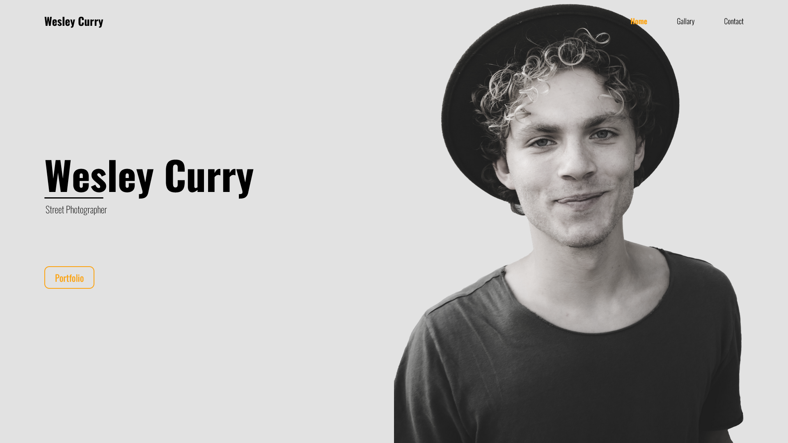
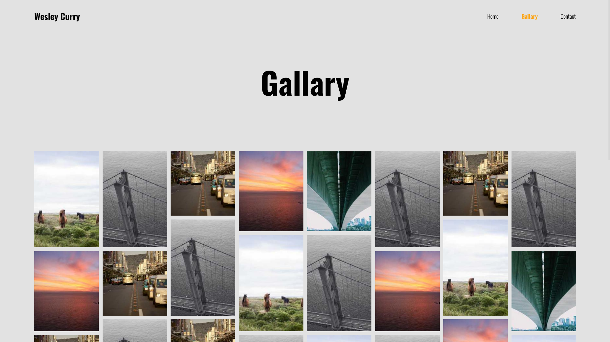
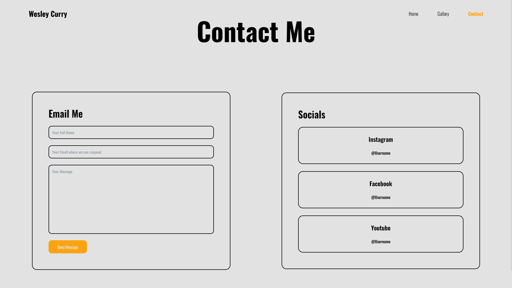

[![Contributors][contributors-shield]][contributors-url]
[![Forks][forks-shield]][forks-url]
[![Stargazers][stars-shield]][stars-url]
[![Issues][issues-shield]][issues-url]
[![MIT License][license-shield]][license-url]
[![LinkedIn][linkedin-shield]][linkedin-url]

<!-- PROJECT LOGO -->
 

  

  <h3 align="center">Wesley Curry Portfolio</h3>

  

     
    <a href="https://github.com/humamchoudhary/wesley-curry-portfolio"><strong>Explore the docs »</strong></a>
     
     
    <a href="https://github.com/humamchoudhary/wesley-curry-portfolio">View Demo</a>
    ·
    <a href="https://github.com/humamchoudhary/wesley-curry-portfolio/issues">Report Bug</a>
    ·
    <a href="https://github.com/humamchoudhary/wesley-curry-portfolio/issues">Request Feature</a>
  

# Wesley Curry Portfolio

Wesley Curry's Portfolio is a test portfolio created using ReactJS and Tailwind CSS. The main object was to get a better grip on both as I have already done multiple projects on ReactJS.

## Demo Images

 
 

 
 

 
 

<!-- CONTACT -->

## Contact

Muhammad Humam Choudhary - [@humam_cho](https://twitter.com/humam_cho) - humamchoudhary@gmail.com

Project Link: [Link](https://github.com/humamchoudhary/wesley-curry-portfolio/)

(<a href="#top">back to top</a>)

## License

[MIT](https://choosealicense.com/licenses/mit/)

<!-- MARKDOWN LINKS & IMAGES -->
<!-- https://www.markdownguide.org/basic-syntax/#reference-style-links -->

[contributors-shield]: https://img.shields.io/github/contributors/humamchoudhary/wesley-curry-portfolio.svg?style=for-the-badge
[contributors-url]: https://github.com/humamchoudhary/wesley-curry-portfolio//graphs/contributors
[forks-shield]: https://img.shields.io/github/forks/humamchoudhary/wesley-curry-portfolio.svg?style=for-the-badge
[forks-url]: https://github.com//humamchoudhary/wesley-curry-portfolio/network/members
[stars-shield]: https://img.shields.io/github/stars/humamchoudhary/wesley-curry-portfolio.svg?style=for-the-badge
[stars-url]: https://github.com/humamchoudhary/wesley-curry-portfolio/stargazers
[issues-shield]: https://img.shields.io/github/issues/humamchoudhary/wesley-curry-portfolio.svg?style=for-the-badge
[issues-url]: https://github.com/humamchoudhary/wesley-curry-portfolio/issues
[license-shield]: https://img.shields.io/github/license/humamchoudhary/wesley-curry-portfolio.svg?style=for-the-badge
[license-url]: https://github.com/humamchoudhary/wesley-curry-portfolio/blob/master/LICENSE.txt
[linkedin-shield]: https://img.shields.io/badge/-LinkedIn-black.svg?style=for-the-badge&logo=linkedin&colorB=555
[linkedin-url]: https://linkedin.com/in/humam-choudhary-362278228/
